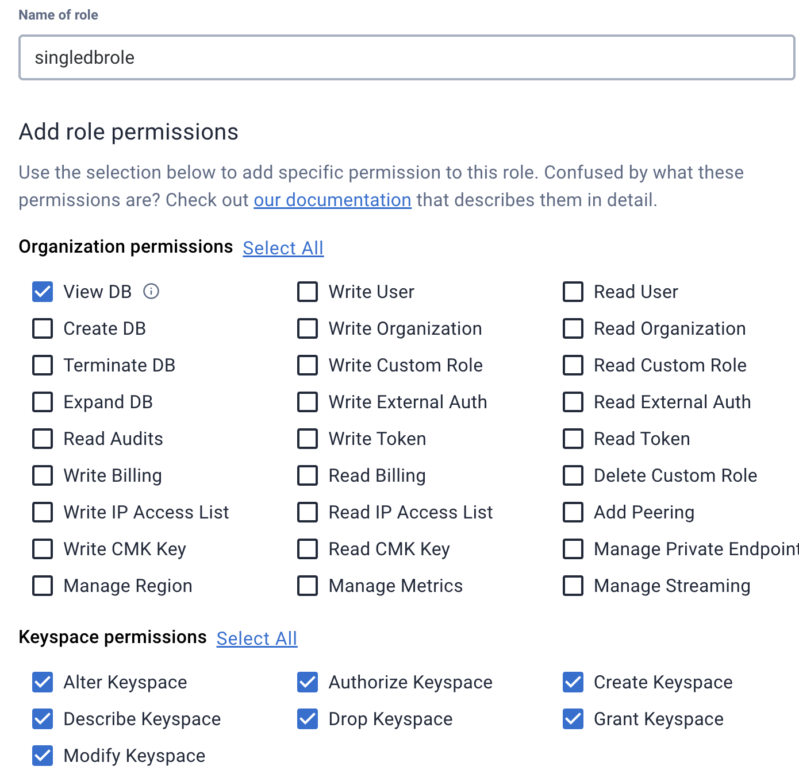
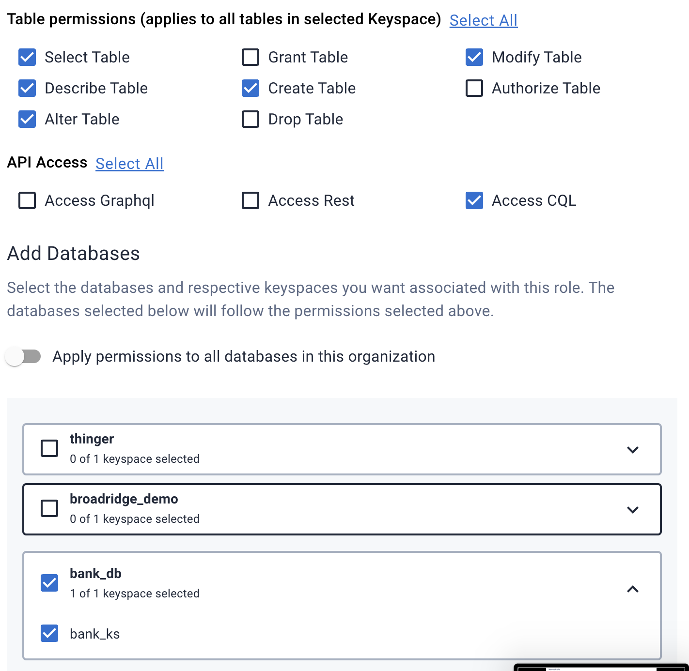
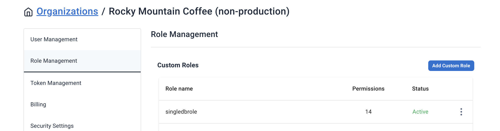

Sample script that creates a database on Astra DB and then creates a custom role named 'singledbrole' which is mapped to a database as desired with screenshots. 

Below is the screenshot showing the custom role created by the terraform code with the desired permissions assigned to it: 

And find the custom role getting mapped to the database based on the binding specified in *main.tf*. 

In addition, please find the screenshot that confirms the creation of this role on the *Role Management* tab in Astra DB: 

